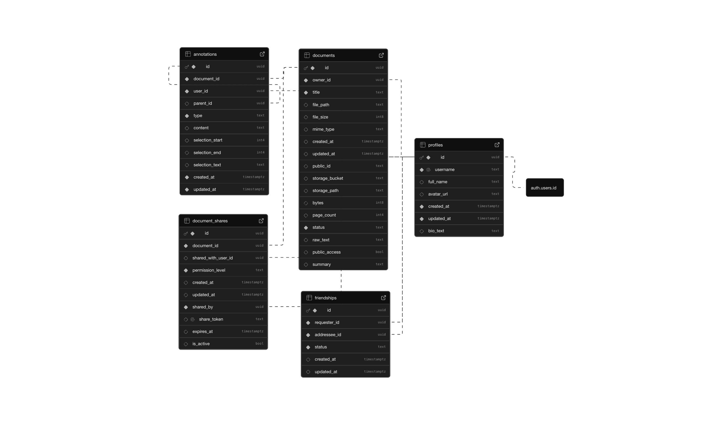

## Tech Stack

### Frontend

- **TypeScript** with **Next.js** (React framework) and **TailwindCSS**
  - Next.js for server-side rendering, SEO-friendly so that the documents can be sharable amongst friends and peers
  - React to manage document viewing and annotation components
  - TailwindCSS is fast and easy to use for UI

### Document Processing

- **PDF.js** for client-side PDF rendering

### Backend & Database

- **Supabase** (PostgreSQL with real-time capabilities)
  - PostgreSQL database stores users, friend connections, documents, and annotations
  - Database triggers and WebSocket connections for real-time sync
  - Integrated file storage for PDF uploads and management
  - Real-time channels for live collaborative annotation viewing

### Authentication

- **Supabase Auth** with Google OAuth integration
  - Secure authentication for document access, sharing, and friend connections

## Code Structure

```
f25-inki/
├── src/
│   ├── app/                    # Next.js app router pages
│   │   ├── api/                # API routes
│   │   ├── dashboard/          # Dashboard page
│   │   ├── documents/          # Document pages
│   │   ├── login/              # Login page
│   │   ├── signup/             # Signup page
│   │   └── share/              # Share token pages
│   ├── components/             # React components
│   │   ├── dashboard/          # Dashboard components
│   │   └── documents/          # Document viewer & annotation components
│   ├── lib/                    # Utilities & helpers
│   │   ├── utils/              # Utility functions
│   │   ├── services/           # Service layer (Supabase clients)
│   │   ├── types/              # TypeScript type definitions
│   │   ├── pdf/                # PDF parsing utilities
│   │   └── supabase/           # Supabase storage helpers
│   ├── services/               # Business logic services
│   │   ├── documentService.ts
│   │   ├── annotationService.ts
│   │   └── pdfExportService.ts
│   └── __tests__/              # Unit tests for utilities
├── e2e/                        # Playwright end-to-end tests
└── docs/                       # Documentation
    └── images/
        └── supabase-schema.png # Database schema diagram
```

## Database Schema



The database consists of:

- **profiles**: User profile information
- **documents**: Document metadata and content
- **annotations**: Document annotations and comments
- **document_shares**: Document sharing relationships
- **friendships**: User friendship connections

## Commands

### Development

```bash
npm run dev          # Start development server (with Turbopack)
npm run build        # Build for production
npm start            # Start production server (port 3000)
npm run lint         # Run ESLint
```

### Testing

```bash
npm test             # Run Jest unit tests
npm run test:watch   # Run tests in watch mode
npm run test:coverage        # Run tests with coverage report
npm run test:coverage:open   # Open coverage report in browser
npm run test:e2e     # Run Playwright E2E tests
npm run test:e2e:ui  # Run E2E tests with UI
npm run test:e2e:headed     # Run E2E tests in headed mode
```

## Testing

### Test Coverage

- **Statements**: 84.27%
- **Branches**: 86.8%
- **Functions**: 80.21%
- **Lines**: 84.27%

### Writing Tests

**Unit Tests (Jest)**

- Location: `src/__tests__/` for utilities, `src/**/*.test.ts` for services
- Pattern: Mock Supabase client, test function logic and error handling
- Example: `src/__tests__/documents_utils.test.ts`

**Component Tests (Jest + React Testing Library)**

- Location: `src/components/**/*.test.tsx`
- Pattern: Mock services, test user interactions and component rendering
- Example: `src/components/documents/DocumentViewer.test.tsx`

**E2E Tests (Playwright)**

- Location: `e2e/*.spec.ts`
- Pattern: Test user workflows, page navigation, and UI interactions
- Example: `e2e/basic.spec.ts`

## Getting Started

First, run the development server:

```bash
npm run dev
```

Open [http://localhost:3000](http://localhost:3000) with your browser to see the result.
